# Lightsaber Bay

[Video Link](https://www.youtube.com/watch?v=QLpI4vb20xU)

<h1>Description</h1>

LightsaberBay is a full-stack shopping application where users can create an account and be provided with 1000 credits to purchase several different styles of sabers on a marketplace. Once they do, they will be able to list them on the marketplace as well at their desired price. Upon successful purchase, they will be notified via message when someone purchases their item and also be supplied with the amount of credits they asked for. 

<h1>Motivation</h1>

I wanted to make this app because unlike my other projects, I have not made an app that had user-to-user interaction. In this case, this app consists of user-to-user interaction in the form of messages sent to users when someone purchases their item. Also, I was always fascinated by shopping applications and curious to know the engines behind it.

<h1>Languages and tools used:</h1>

  
  
  
  
  
  
  
  
  
  

 
<h1>How to use:</h1>

First, you will be brought to the greeting/landing page. It will display the name of the app and below, list a couple of highlights of the most recently listed items.

 

    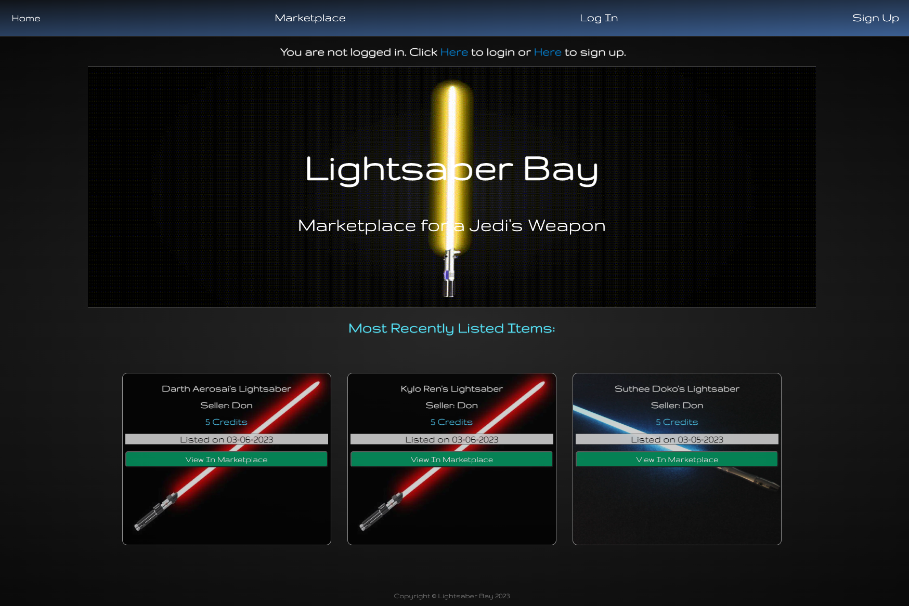

 

On the top of the page, there is a nav bar that will take you to the marketplace to see all available lightsabers for sale. However, you will not be able to see them unless you create an account and are logged in. It will bring you to a link to prompt you to do so:

 

  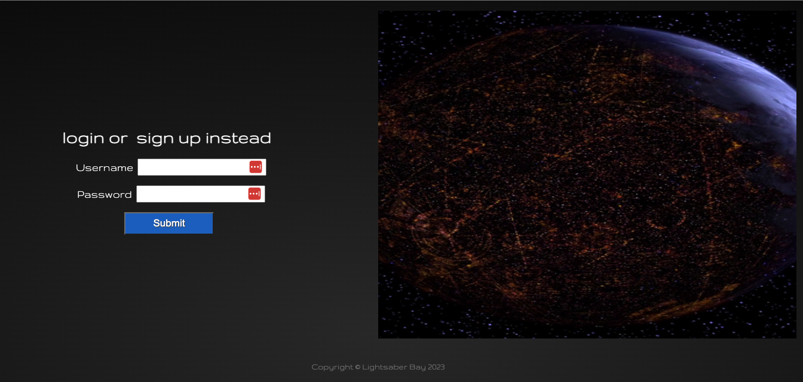

 

We will log in as user "Don".

After a successful login, you will be brought back to the greeting page where you will be notified if you have any messages or not.

 

  

 

Now, when you click the "marketplace" link in the nav bar, you will see the meat and bones of the application which is the shopping experience.

 

  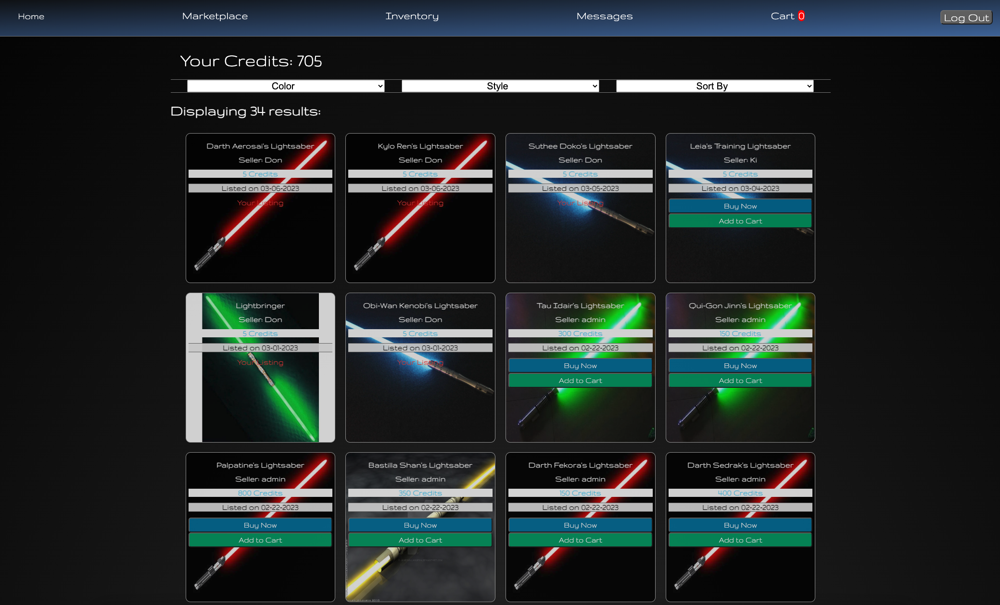

 

On the top of the marketplace view, you will see the amount of credits you have displayed. On each new account creation, you start with 1000.

You will also see a filtering section. You can filter your results by color of saber, style, and also sort by most recent, price: low to high, price: high to low.

As you can see below, the filters of "red", "single-bladed" only, and sorted from price low to high, all work as intended:

 

  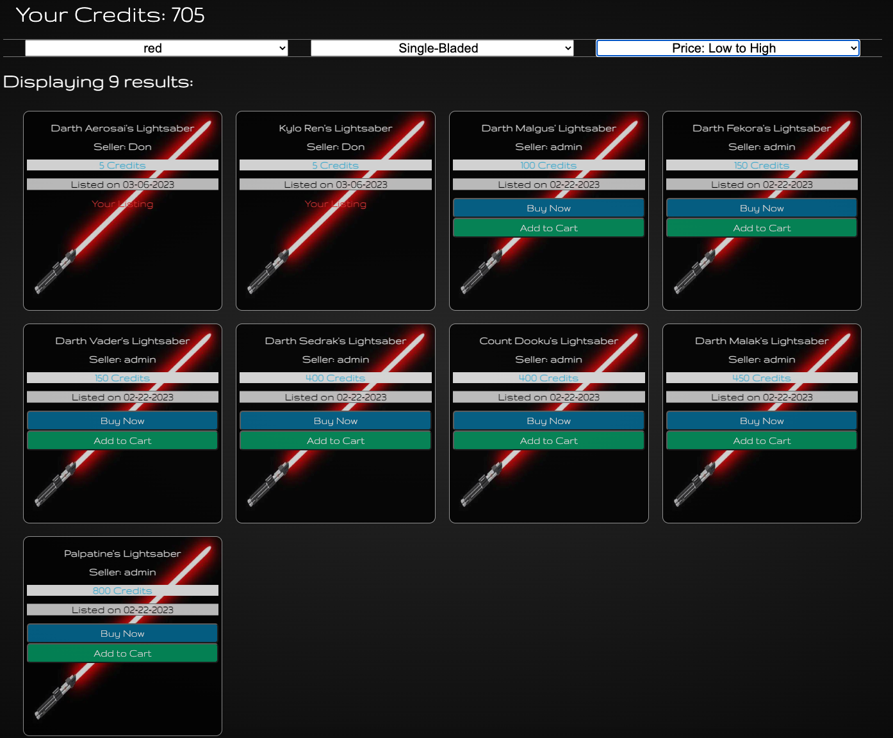

 

You can now choose to purchase an item directly through the "Buy now" button, which will alert if you are sure you want to complete the purchase.

 

  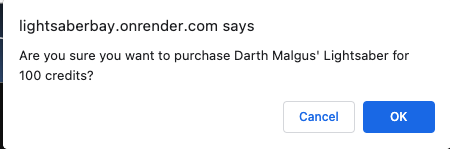

 

Once the purchase is made this way, you can then go to the "Inventory" tab on the nav bar to see which items you have purchased.

As you can see, Darth Malgus' lightsaber is now in our inventory under the "Not listed for sale section:

 

  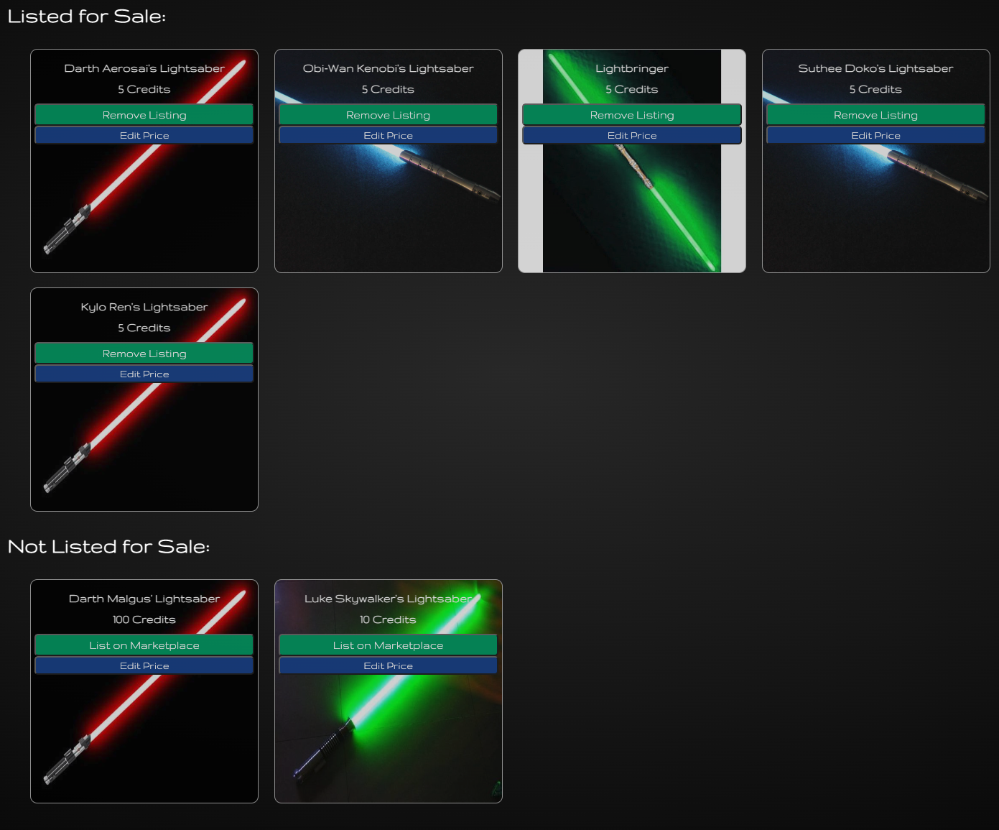

 

Here in your inventory, you can see the items you choose to list for sale on the marketplace, edit the prices of your items, and list certain items on the marketplace if not already.

Here, you can edit the price of the item you just bought, and then list it back on the marketplace:

 

  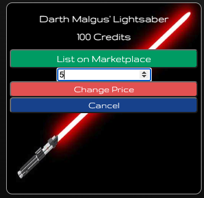

 

Another way to purchase items is by adding them to your cart, which allows you to purchase multiple items at once.

Simply go back to the marketplace tab and click the "Add to cart" button on the items you want. 

 

  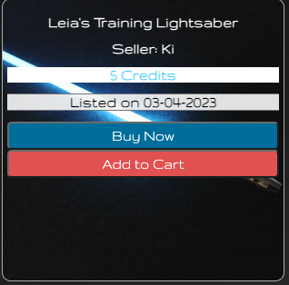

 

In this case, I added 2 items to my cart and as you can see, the "Cart" tab in the nav bar properly populates with the # of items I have in my cart.

 

  

 

Now, let's go to our "Cart" tab.

 

  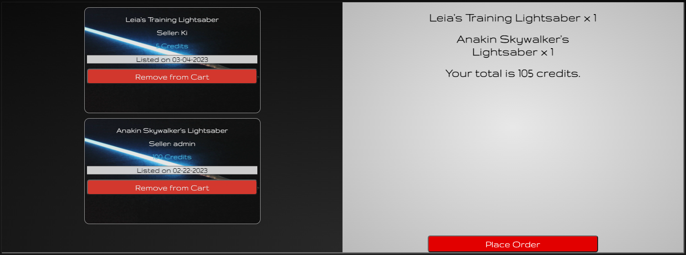

 

Our 2 items are now in our cart, showing us the total price of the items combined.

We can choose to remove a specific item from our cart as well, if we've changed our mind.

If we are sure of our purchase, and have sufficient credits, we can then place our order using the big red button at the bottom right.

Like with any big purchase, it will as us if we are certain.

 

  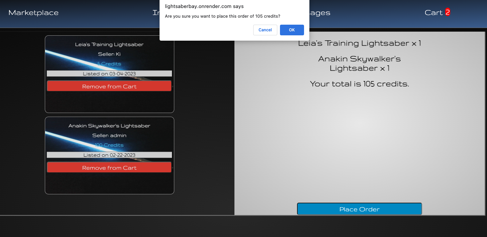

 

Once the purchase is completed, our cart will be empty:

 

  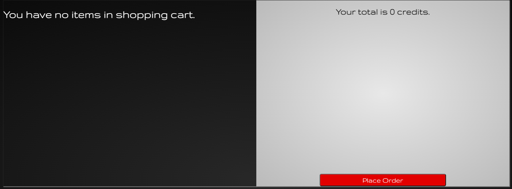

 

Now, let's go back to our inventory again and see the 2 items we've just purchased, as well as our credits amount decrease.

 

  

 

The two blue lightsabers we've just purchased are now in our inventory. We can now list them for a greater price than what we've bought them for, or simply keep them in our collection.

 

  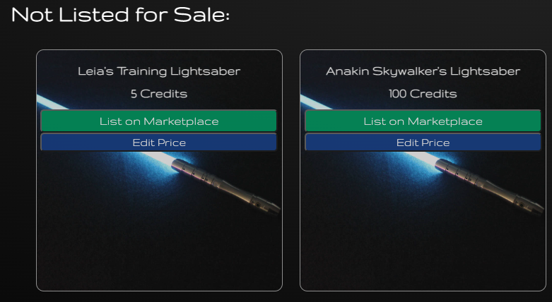

 

Specifically, we purchased an item called "Leia's Training Lightsaber" from a seller named "Ki". 

Let's log out of our current account as "Don", and log into "Ki"'s account to see if he was properly messaged about "Don" purchasing his item.

Log out button on the nav bar:

 

  

 

Let's log into Ki's account. Once we do, we can see that we're greeted with a notification that we have 3 unread messages.

 

  

 

Now, let's go to our "Messages" tab in the nav bar.

 

  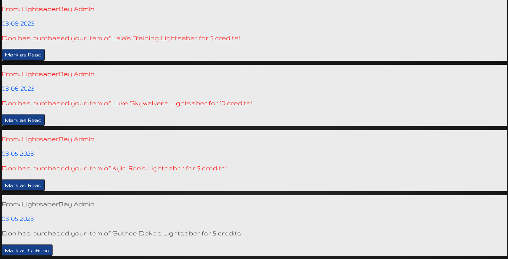

 
As expected, we see a list of ordered messages, from most recent to oldest, and the top message is that of Don purchasing our item of "Leia's Training Lightsaber" for 5 credits.

We can choose to mark them as read or leave them as unread, and it will properly update our notification message on the greeting page.

In this case, I will mark them all as read to clear out my inbox, so that I don't see any notifications.

 

  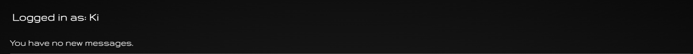

 
Once done with your shopping experience, you can log out and return another time.
  
